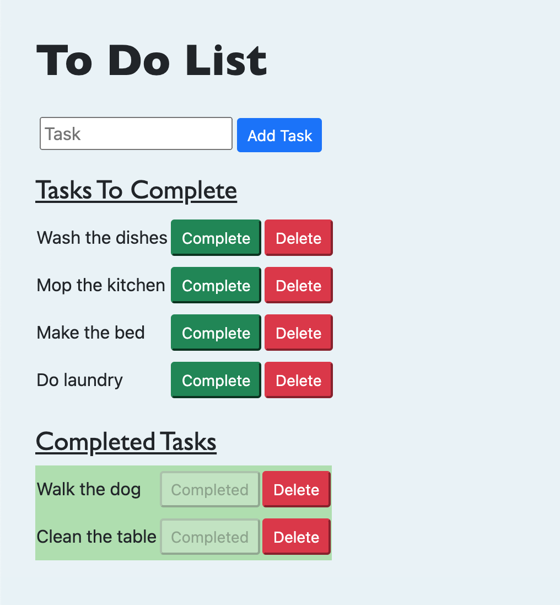

# SQL To-Do List

## Description

_Duration: 1 Week_

In this project a user can input a task (One input element) and add to their to-do list. The input is captured and the data is stored in a SQL Database. The tasks that are created then render in the Tasks to Complete area. Two buttons will appear on each task allowing user to [Complete] or [Delete] the task. If the user decides to [Complete] the task, the task is rendered in the Completed Tasks area. The user can [Delete] tasks which will remove from the DOM and the database.

## Screen Shot

### Prerequisites

- [Node.js](https://nodejs.org/en/)
- [Postico](https://eggerapps.at/postico/)
- PostgreSQL

## Installation

1. Fork and clone project
2. Open with the editor of your choice
3. Create a database through Postico called `weekend-to-do-app`
4. Run the commands found in `DATABASE.sql` file
5. Open terminal and run:
6. `brew services start postgresql`
7. `npm install`
8. `npm start`
9. Navigate to `http://localhost:5000` on your preferred web browser
10. When finished to stop postgresql run the command:
11. `brew services stop postgresql`

## Usage

Interactive to-do list

1. Type a to-do task in the input field
2. Click on [Add Task] button
3. Two buttons [Complete] and [Delete] will appear on the task created
4. Once task is finished, click on [Complete] button. This will move it to the Completed area
5. If you want to delete a task, click on the [Delete] button.
6. Deleted tasks get removed from DOM and database

## Built With

- PostgreSQL
- Node.js
- Express.js
- jQuery
- Javascript
- Bootstrap
- HTML
- CSS

## Acknowledgement

Thanks to Prime Digital Academy who equipped and helped me to make this application a reality.

## Support

If you have suggestions or issues, please email me at terry.okeefe87@gmail.com